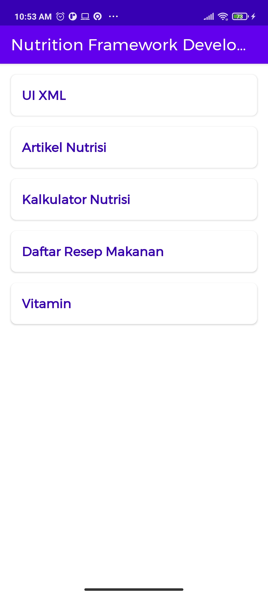
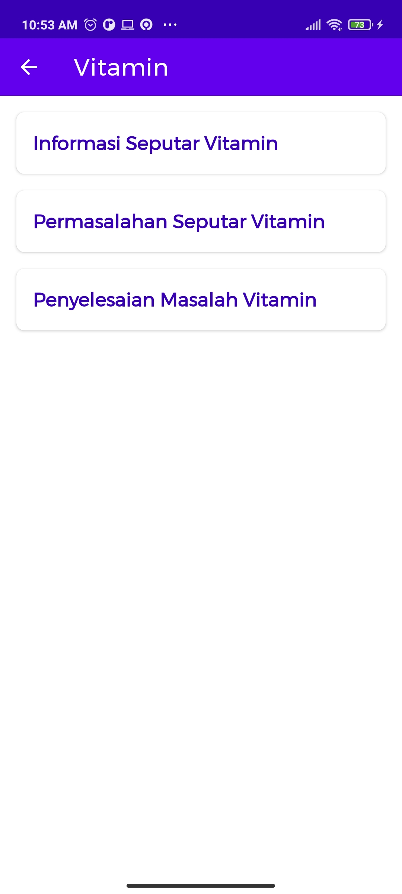
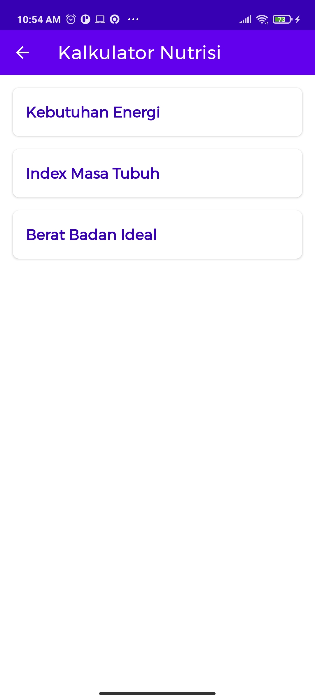
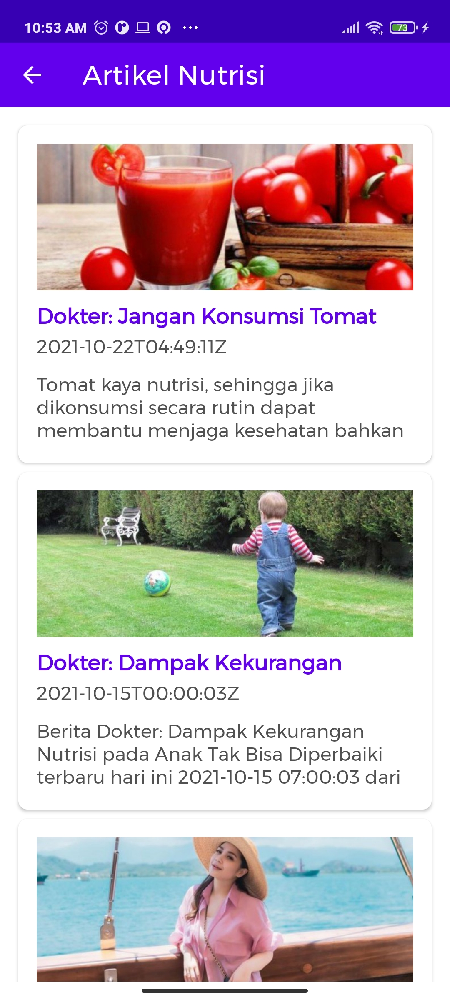

## About This Project (work-in-progress 👷🔧️👷‍♀️⛏)
[](https://jitpack.io/#amirisback/nutrition-framework)
- Pengembang Framework untuk Membuat Aplikasi Seputar Permasalahan Gizi berbasis Platform Android
- General Framework for Application Development Around Nutrition Using the Android Platform, Skripsi S1 Muhammad Faisal Amir from Telkom University
- [Consumer android from nutrition-framework API](https://github.com/amirisback/nutrition-framework-app)
- [Consumer desktop from nutrition-framework API](https://github.com/amirisback/nutrition-framework-desktop)

## Version Release
This Is Latest Release

    ~ Beta Release
    $version_release = 0.0.2-alpha10

What's New??

    * Beta Release *
    * Multi Platform Library *
    * Compose UI Multi Platform *
    * Update Compose Component *

## Screen Shoot Apps - Android

| SS 1 | SS 2 | SS 3 | SS 4 |
|:----:|:----:|:----:|:----:|
| |  |  |  |

## Download this project

### Step 1. Add the JitPack repository to your build file (build.gradle : Project / Root)

#### <Option 1> Groovy Gradle (build.gradle)

    // Add it in your root build.gradle at the end of repositories:

    allprojects {
        repositories {
            ...
            maven { url 'https://jitpack.io' }
        }
    }

#### <Option 2> Kotlin DSL Gradle (build.gradle.kts / settings.gradle.kts)

```kotlin
// Add it in your root build.gradle.kts at the end of repositories:

allprojects {
    repositories {
        ...
        maven { url = uri("https://jitpack.io") }
    }
}
```

### Step 2. Add the dependency (build.gradle : Module)

#### <Option 1> Groovy Gradle (build.gradle)

    dependencies {
        // library nutrition-framework
        implementation 'com.github.amirisback:nutrition-framework:0.0.2-alpha10'
    }

#### <Option 2> Kotlin DSL Gradle (build.gradle.kts)

    dependencies {
        // library nutrition-framework
        implementation("com.github.amirisback:nutrition-framework:0.0.2-alpha10")
    }

## Application Framework


## Documentation
- SK TA [Click Here](https://github.com/amirisback/nutrition-framework/raw/master/docs/bundle/Muhammad%20Faisal%20Amir_1301198497_SK_TA.pdf)
- General [Click Here](https://github.com/amirisback/nutrition-framework/tree/master/docs)
- Bundle [Click Here](https://github.com/amirisback/nutrition-framework/tree/master/docs/bundle)
- Guide [Click Here](https://github.com/amirisback/nutrition-framework/tree/master/docs/guide)
- Journal List [Click Here](https://github.com/amirisback/nutrition-framework/tree/master/docs/journal)
- Theory [Click Here](https://github.com/amirisback/nutrition-framework/tree/master/docs/theory)
- Proposal [Click Here](https://github.com/amirisback/nutrition-framework/tree/master/docs/proposal)
- Guidance [Click Here](https://github.com/amirisback/nutrition-framework/tree/master/docs/guidance)
- Image [Click Here](https://github.com/amirisback/nutrition-framework/tree/master/docs/image)
- Design on Figma [Click Here](https://www.figma.com/file/Ons8XY0YvxecwC71Aa92Qj/TA?node-id=0%3A1)
- Sheet Feedback [Click Here](https://docs.google.com/spreadsheets/d/1P8U2lu8odQJwLPD3QiSJGJXAgocdc_H5j7PdT23lPZc/edit#gid=0)
- Diagram on Draw Io [Click Here](https://drive.google.com/file/d/1OCsoqVV3UYnLxpUK9jYm2yNjcFj9sUPP/view?usp=sharing)
- Research Nutrition Apps [Click Here](https://docs.google.com/spreadsheets/d/1t0aWoMrBEVfeZTIV438V8P0YMeGUK2VV_HHC7qnZUtU/edit?usp=sharing)
- Final Task [Click Here](https://github.com/amirisback/nutrition-framework/raw/master/docs/Muhammad%20Faisal%20Amir_1301198497_TUGAS_AKHIR.docx)

## Telkom University Lecturers
- Dana Sulistyo Kusumo, S.T., M.T., PhD. - danakusumo@telkomuniversity.ac.id
- Shinta Yulia Puspitasari, S.T., M.T. - shintayulia@telkomuniversity.ac.id

## Problem
Membuat beberapa aplikasi tentang beberapa nutrisi. <br>
- Self assesment (Penyakit bawaan / tidak, profiling orang untuk aplikasi,
- Kategori (Contoh : Vitamin D, sehat perlu suplemen)
- Rekomendasi makanan / obat, rekomendasi penangan
- 1 Aplikasi bisa di edit / customize dengan berbagai macam keluhan
- Jika di website yaitu bootstrap

## Screen Shoot Apps - Desktop


## Architecture
-   Pattern  [Model-View-ViewModel](https://en.wikipedia.org/wiki/Model%E2%80%93view%E2%80%93viewmodel)  (MVVM) facilitating a [separation](https://en.wikipedia.org/wiki/Separation_of_concerns) of development of the graphical user interface.
-   [S.O.L.I.D](https://en.wikipedia.org/wiki/SOLID)  design principles intended to make software designs more understandable, flexible and maintainable.

## Tech-stack
Min API level is set to 21, so the presented approach is suitable for over 94% of devices running Android. This project takes advantage of many popular libraries and tools of the Android ecosystem. Most of the libraries are in the stable version unless there is a good reason to use non-stable dependency.
-   [Jetpack](https://developer.android.com/jetpack):
    -   [Android KTX](https://developer.android.com/kotlin/ktx.html)  - provide concise, idiomatic Kotlin to Jetpack and Android platform APIs.
    -   [AndroidX](https://developer.android.com/jetpack/androidx)  - major improvement to the original Android  [Support Library](https://developer.android.com/topic/libraries/support-library/index), which is no longer maintained.
    -   [View Binding](https://developer.android.com/topic/libraries/view-binding)  - allows you to more easily write code that interacts with views/
    -   [Lifecycle](https://developer.android.com/topic/libraries/architecture/lifecycle)  - perform actions in response to a change in the lifecycle status of another component, such as activities and fragments.
    -   [LiveData](https://developer.android.com/topic/libraries/architecture/livedata)  - lifecycle-aware, meaning it respects the lifecycle of other app components, such as activities, fragments, or services.
    -   [Navigation](https://developer.android.com/guide/navigation/)  - helps you implement navigation, from simple button clicks to more complex patterns, such as app bars and the navigation drawer.
    -   [Room](https://developer.android.com/topic/libraries/architecture/room)  - persistence library provides an abstraction layer over SQLite to allow for more robust database access while harnessing the full power of SQLite.
    -   [ViewModel](https://developer.android.com/topic/libraries/architecture/viewmodel)  - designed to store and manage UI-related data in a lifecycle conscious way. The ViewModel class allows data to survive configuration changes such as screen rotations.
-   [Coroutines](https://kotlinlang.org/docs/reference/coroutines-overview.html)  - managing background threads with simplified code and reducing needs for callbacks.
-   [Coroutines Flow](https://kotlinlang.org/docs/reference/coroutines-overview.html)  - cold asynchronous data stream that sequentially emits values and completes normally or with an exception
-   [Dagger2](https://dagger.dev/)  - dependency injector for replacement all Factory classes.
-   [Retrofit](https://square.github.io/retrofit/)  - type-safe HTTP client.
-   [Glide](https://github.com/bumptech/glide)  - image loading and caching library
-   [Compose](https://www.jetbrains.com/lp/compose/) - Compose for Desktop simplifies and accelerates UI development for desktop applications, and allows extensive UI code sharing between Android and desktop applications. Currently in alpha.
-   [Coil](https://coil-kt.github.io/coil/) - Coroutine Image Loader

## Inpiration
- frogo-log ( [Muhammad Faisal Amir](https://github.com/amirisback) - [Project](https://github.com/amirisback/frogo-log) )
- frogo-admob ( [Muhammad Faisal Amir](https://github.com/amirisback) - [Project](https://github.com/amirisback/frogo-admob) )
- frogo-recycler-view ( [Muhammad Faisal Amir](https://github.com/amirisback) - [Project](https://github.com/amirisback/frogo-recycler-view) )
- frogo-notification ( [Muhammad Faisal Amir](https://github.com/amirisback) - [Project](https://github.com/amirisback/frogo-notification) )

- android-kick-start ( [Muhammad Faisal Amir](https://github.com/amirisback) - [Project](https://github.com/amirisback/android-kick-start) )
- android-kick-start-modular ( [Muhammad Faisal Amir](https://github.com/amirisback) - [Project](https://github.com/amirisback/android-kick-start-modular) )
- desktop-experimental-catalgoue ( [Muhammad Faisal Amir](https://github.com/amirisback) - [Project](https://github.com/amirisback/desktop-experimental-catalgoue) )
- jitpack-library-kotlin-dsl-guide( [Muhammad Faisal Amir](https://github.com/amirisback) - [Project](https://github.com/amirisback/jitpack-library-kotlin-dsl-guide) )

- frogo-android-sdk ( [Frogobox](https://github.com/frogobox) - [Project](https://github.com/frogobox/frogo-android-sdk) )
- frogo-android-ui-kit ( [Frogobox](https://github.com/frogobox) - [Project](https://github.com/frogobox/frogo-android-ui-kit) )
- frogo-consume-api ( [Frogobox](https://github.com/frogobox) - [Project](https://github.com/frogobox/frogo-consume-api) )

- color-console ( [Nazmul Idris](https://github.com/nazmulidris) - [Project](https://github.com/nazmulidris/color-console) )
- ComposeReorderable ( [Andre Claßen](https://github.com/aclassen) - [Project](https://github.com/aclassen/ComposeReorderable) )
- ComposeCookBook ( [Gurupreet Singh](https://github.com/Gurupreet) - [Project](https://github.com/Gurupreet/ComposeCookBook) )
- PeopleInSpace ( [John O'Reilly](https://github.com/joreilly) - [Project](https://github.com/joreilly/PeopleInSpace) )

## Attention !!!
- Please enjoy and don't forget fork and give a star
- Don't Forget Follow My Github Account


